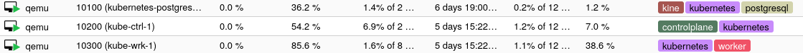

Terraform Proxmox Cloud Init Kubernetes
===

[![Contributors][contributors-shield]][contributors-url]
[![Forks][forks-shield]][forks-url]
[![Stargazers][stars-shield]][stars-url]
[![Issues][issues-shield]][issues-url]
[![MIT License][license-shield]][license-url]

This module sets up a Kubernetes cluster on a proxmox hypervisor using cloud-init for automation. It provisions the necessary nodes, deploys the kubernetes control plane and worker nodes, and configures the networking accordingly. The module assumes you have a proxmox server with an active PVE install. It does not require a prepared image and just uses the default debian cloud init image.

This module should also provide capabilities to roll out multi arch clusters, but it is currently in a early beta status due to the fact that proxmox on rpi is still a bit unstable when building multi arch clusters!

## Module Versions
This module comes in different flavours as we progress in different endeavors. A upcomming list should help you to determine which release may be applicable for you.

* release/1.0
  *  Release 1.0 represents the initial setup of this terraform module and may contain serveral quirks and annoyances
  *  It is basically ready to work in your environment but may be a bit tricky to get things going
* release/1.1
  * Release 1.1 is a minor rework to ease up some quirks and annoyances 
* release/2.0
  * Release 2.0 is a major redesign of this terraform module and provides a more convienient way of configuring your desired deployment
  * It also introduces kine as etcd replacement
    * Head over to the awesome repository here to get a first grip: https://github.com/k3s-io/kine
* dev
  * Current development branch which may be highly unstable and is definitly not production ready
* main
  * Reflects the latest changes on this module and follows is the father branch of every release

### Development Targets
This module is currently only maintained on the latest release. Changes on the currently dev or main version are not backported to older releases. Feel free to contribute and backport some things to older versions! A contribution is always welcome!

As of writing the current maintained version is 2.0 and following.

## Setup Guide

The setup guide may change according to your desired version. Please refer to each branchs setup guide to view the actual setup documentation. This guide is subject to change when changes occure on the development or main branch. 

### Initial Configuration
Start your terraform setup with a generic `main.tf` and import the required providers.
```tf
terraform {
  required_providers {
    proxmox = {
      source  = "bpg/proxmox"
      version = "0.70.1"
    }
    macaddress = {
      source  = "ivoronin/macaddress"
      version = "0.3.2"
    }
  }
}
```
As next code snippet we need to configure our proxmox provider. It helps to use aliases for easier references on multiple enviroments.

```tf
provider "proxmox" {
  alias    = "YOUR_PVE_HOSTNAME"
  endpoint = var.pve_node_HOSTNAME.endpoint
  insecure = var.pve_node_HOSTNAME.insecure

  username = var.pve_username
  password = var.pve_password

  #api_token = var.pve_auth.api_token
  #ssh {
  #  agent    = true
  #  username = var.pve_auth.username
  #}

  tmp_dir = "/var/tmp" #feel free to change this to a directory you desire
}
```
The commented parts describe a different communication way between terraform and proxmox. Per default most users seem to enjoy connect with a username and password. Others a connection via ssh. Please refer to the *Authentication* documentation within the offical guide found here: https://registry.terraform.io/providers/bpg/proxmox/latest/docs#authentication

As next step create a `variables.tf` and paste the following content into it.
```tf
/**
* PVE Node Configuration
*/
variable "pve_node_HOSTNAME" {
  description = "Proxmox server configuration for pve node"
  type = object({
    node_name = string
    endpoint  = string
    insecure  = bool
  })
}

variable "pve_auth" {
  description = "Auth configuration for pve node"
  type = object({
    username  = string
    api_token = string
  })
  sensitive = true
}
```
Please adjust the hostnames accordingly to your infrastructure and replace all references in your `main.tf`.

As next big step we need to add the kubernetes module to the `main.tf` and configure it. The following snippet is a just a possible configuration. Please review it!
```tf
module "kubernetes" {
  source = "git::https://github.com/deB4SH/terraform-proxmox-cloud-init-kubernetes.git?ref=main"

  providers = {
    proxmox = proxmox.YOUR_ALIAS
  }

  pve_default_node = "YOUR_PVE_NODE"
  pve_network_default_gateway = "10.10.10.1"

  dns_configuration = {
    domain = "."
    servers = ["10.10.20.1"]
  }
  # Images
  os_images_datastore_id = "local-lvm"
  # User Configuration
  vm_user = "myAwesomeVmUser
  vm_user_password = "MySecurePasswordThatIGenerated" # mkpasswd -m sha-512
  vm_user_public_key = "myPubKey"
  # Postgre Configuration
  postgres_vm_node = null
  postgres_vm_ipv4 = "10.10.10.2/22"
  postgres_vm_network_gateway = null
  postgres_vm_disk_efi_datastore_id = "local-lvm"
  postgres_vm_disk_datastore_id = "local-lvm"
  postgres_vm_disk_size = 64
  postgres_vm_cpu_core_count = 2
  postgres_vm_memory_count = 1024
  postgres_conf_admin_pw = "SuperSecureAdminPasswordForLocalAccess"
  postgres_conf_kine_pw = "SuperSecurePasswordForLocalAccess"
  postgres_conf_network_address = "10.10.10.0/22"

  kubernetes_controlplanes = [
    {
      node = YOUR_PVE_NODE"
      name = "kube-ctrl-1"
      id_offset = 0
      ip = "10.10.10.3/22"
      vm_memory_count = 4096
    }
  ]

  kubernetes_workers = [
    {
      node = "YOUR_PVE_NODE"
      name = "kube-wrk-1"
      id_offset = 0
      ip = "10.10.10.3/22"
      vm_memory_count = 8128
      vm_cpu_count = 8
    }
  ]

}
```
This snippet describes a pretty minimalistic setup and provisions three vms.
A postgre vm that contains the etcd backend storage, a kubernetes control plane and a kubernetes worker node. 



The module is quite flexible starting from release/2.0 and allows many fallback configuration. A complete variable overview could be obtained when reviewing the default variables here: https://github.com/deB4SH/terraform-proxmox-cloud-init-kubernetes/blob/main/variables.tf

As closing words I would like to give you some things to consider:
* It is advised to provide a debian apt cache server in your environment when working and debugging with this setup. 
* Put variables also in the variables.tf like vm_user vm_password and other parts

### FAQ
Some questions that came up in different talks or chats. 

#### FAQ: Why import macaddresses?
This is just a convienience feature for dhcp environments. Some prefer configuring ips at the router/switch side and this could enable you to keep the same mac addresses all the time at your router.

#### FAQ: I deployed everything but the kubectl get nodes says everything is Not Ready?
This is a desired feature. This setup deploys the kubernetes environment without kube proxy enabled. Therfor there is no networking solution available. 
Installing a networking layer is highly advised as second step in your deployment. Some appliances that are working with this setup are using argocd or sveltos as service to get things going within your new cluster.
As network engine I would suggest either flannel or cilium but due to the plug-and-play possibilities of kubernetes feel free to test things out!

A cilium installation guide is provided here: https://docs.cilium.io/en/stable/gettingstarted/k8s-install-default/#install-cilium
A flannel guide here: https://github.com/flannel-io/flannel/blob/master/Documentation/kubernetes.md

You could also fork this repository and enable kubeproxy again! Everything is possible.

#### FAQ: I'm getting errors ("local" does not support content type "snippets")
You need to enable snippets on your local storage. You can do this via ui. `Datacenter -> Storage -> select local -> Edit -> also select Snippets` or via console `pvesm set local --content images,rootdir,vztmpl,backup,iso,snippets`

#### FAQ: Where is my kubeconfig?
The resulting kubeconfig is automatically places within the `output` folder of your terraform module directory.

#### FAQ: I copy pasted everything how do I progress things?
Here is a easy steps list:
* do a `terraform init` to download everything required
* do a `terraform apply` to deploy all vm to your proxmox environment
* wait for a few minutes so everything could start up according to your configuration
* do some first things with your fresh kubernetes cluster

---

[contributors-shield]: https://img.shields.io/github/contributors/deb4sh/terraform-proxmox-cloud-init-kubernetes.svg?style=for-the-badge
[contributors-url]: https://github.com/deb4sh/terraform-proxmox-cloud-init-kubernetes/graphs/contributors
[forks-shield]: https://img.shields.io/github/forks/deb4sh/terraform-proxmox-cloud-init-kubernetes.svg?style=for-the-badge
[forks-url]: https://github.com/deb4sh/terraform-proxmox-cloud-init-kubernetes/network/members
[stars-shield]: https://img.shields.io/github/stars/deb4sh/terraform-proxmox-cloud-init-kubernetes.svg?style=for-the-badge
[stars-url]: https://github.com/deb4sh/terraform-proxmox-cloud-init-kubernetes/stargazers
[issues-shield]: https://img.shields.io/github/issues/deb4sh/terraform-proxmox-cloud-init-kubernetes.svg?style=for-the-badge
[issues-url]: https://github.com/deb4sh/terraform-proxmox-cloud-init-kubernetes/issues
[license-shield]: https://img.shields.io/github/license/deb4sh/terraform-proxmox-cloud-init-kubernetes.svg?style=for-the-badge
[license-url]: https://github.com/deb4sh/terraform-proxmox-cloud-init-kubernetes/blob/main/LICENSE.txt